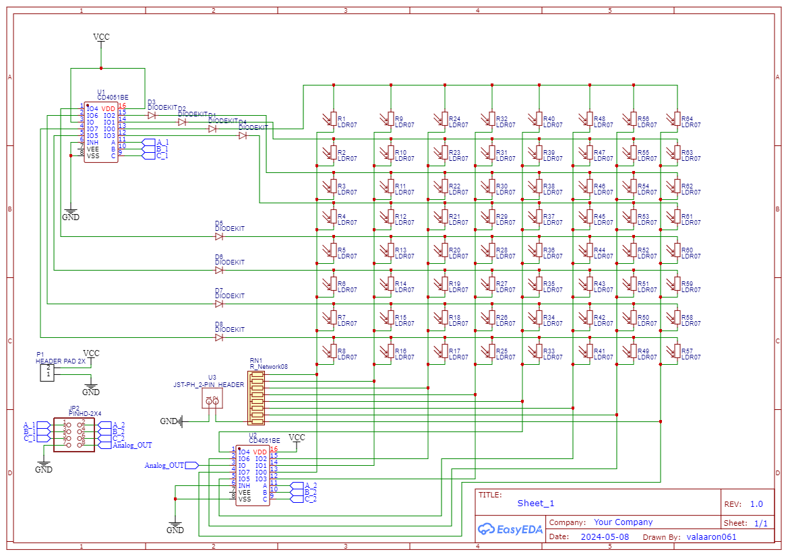
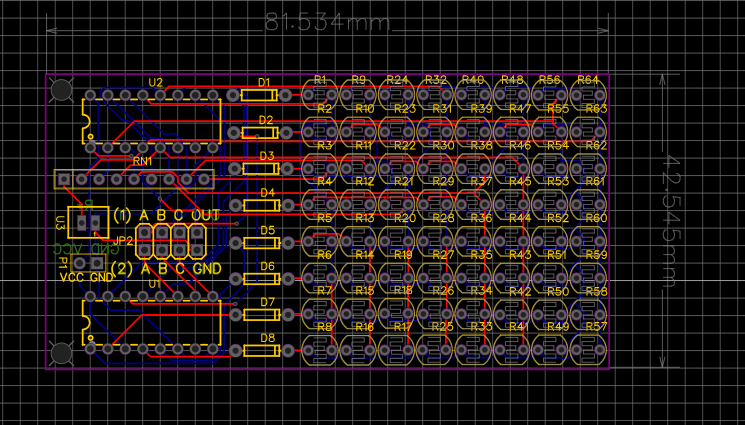

# LDR-Camera-Sensor
Making an 8x8 pixel camera sensor using LDR Photoresistor as the sensor

## Design

The components used are Photoresistor, 10kΩ resistor array, cd4051be de/multiplexer, and diode

</img>

One cd4051be is used to inject 5V into each row of the photoresist, while the second cd4051be reads the voltage on each column that is connected to the voltage divider, so by using only 2 cd4051be it can be used to read each array

</img>

## Results

Example result

